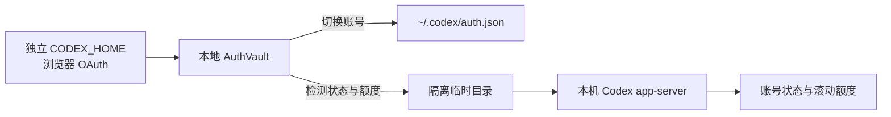

# Codex Account Switcher

<div align="center">

**一个原生、轻量、安全的 macOS Codex 多账号切换与额度监控工具。**


</div>

Codex Account Switcher 将不同 Codex 账号的本地登录档安全保存在 Mac 上，让你可以从主窗口或菜单栏快速切换账号，同时查看滚动额度、重置时间和登录状态。整个过程不读取浏览器 Cookie，也不会把凭据发送到第三方服务器。

> [!IMPORTANT]
> 不要为了添加账号而在 Codex 应用中点击“退出登录”。退出会撤销当前会话的刷新令牌，已有的 `auth.json` 副本也可能随之失效。请使用应用内的“添加新账号”或“重新授权这个账号”。

## 功能亮点

| 能力 | 说明 |
| --- | --- |
| 隔离登录 | 使用独立 `CODEX_HOME` 完成标准浏览器 OAuth，不覆盖当前 Codex 登录 |
| 一键切换 | 切换前自动归档当前账号，再原子替换 `~/.codex/auth.json` |
| 本地私密存储 | 登录档目录权限为 `0700`、文件权限为 `0600`，并排除系统备份 |
| 额度监控 | 显示 5 小时 / 7 天等滚动窗口的剩余比例与重置倒计时 |
| 菜单栏操作 | 查看最低剩余额度、切换账号、导入账号及批量刷新 |
| 智能提醒 | 支持 10% / 20% / 30% 低额度提醒和额度窗口重置通知 |
| 定时检测 | 每 5 / 15 / 30 / 60 分钟自动刷新账号状态与额度 |
| Codex 联动 | 可在切换账号后自动重启 Codex macOS 应用 |

## 系统要求

- macOS 13 Ventura 或更高版本
- 已安装 [Codex macOS 应用](https://openai.com/codex/) 或可用的 Codex CLI
- 从源码构建时需要 Xcode Command Line Tools 和 Swift 5.9+

## 快速开始

目前可直接从源码构建本地版本：

```bash
git clone https://github.com/pengshengege/CodexAccountSwitcher.git
cd CodexAccountSwitcher
./Scripts/build_app.sh
open "dist/Codex Account Switcher.app"
```

`build_app.sh` 会生成本地临时签名的应用，适合个人使用和开发调试。

## 使用方法

1. 安装并打开 Codex macOS 应用。
2. 如果当前已经登录，在 Codex Account Switcher 中选择“更多 → 导入当前已登录账号”。
3. 点击“添加新账号”。应用会创建隔离的临时 `CODEX_HOME`，并打开标准 ChatGPT 浏览器登录页。
4. 建议使用隐私窗口，或切换到目标账号对应的浏览器个人资料完成登录。
5. 登录成功后，账号会自动保存到本机私密存储；临时登录目录会立即删除。
6. 以后点击账号卡片中的“切换到这个账号”即可。若未启用自动重启，请在切换后点击“立即重启”。

应用启动后会常驻菜单栏。你可以在“系统设置 → 菜单栏与额度提醒”中启用低额度提醒、选择阈值，并配置自动检测间隔。

## 安全与隐私

登录凭据不会写入普通账号列表，而是存放在仅当前用户可访问的 `AuthVault` 中：

```text
~/Library/Application Support/CodexAccountSwitcher/
├── accounts.json                  # 名称、邮箱、套餐、状态和额度摘要
└── AuthVault/                     # 原始登录档；目录 0700，文件 0600
```

- 新账号通过本机 Codex 的标准浏览器 OAuth 登录，不继承当前进程中的 API Key 或 Access Token。
- 独立登录成功、失败或取消后，临时目录都会被清理。
- 切换目标固定为 `~/.codex/auth.json`，写入过程使用原子替换并恢复 `0600` 权限。
- 后台检测从 `AuthVault` 读取凭据，不访问旧版钥匙串，因此不会反复弹出钥匙串授权窗口。
- v0.2.2 及更早版本保存到钥匙串的账号，只会在第一次主动切换时读取并迁移一次。
- 应用不会读取 Safari 或 Chrome Cookie，也不会将登录档发送到第三方服务器。
- 删除账号会移除对应的本地登录档，但不会主动退出当前正在使用的 Codex 会话。

## 工作原理



额度检测会启动隔离的临时 Codex 后端，使用选定账号向 OpenAI 读取状态。检测完成后临时目录会被删除，当前使用中的登录档不会被修改。

## 开发与测试

直接运行 Swift Package：

```bash
swift run CodexAccountSwitcher
```

运行单元测试：

```bash
swift test
```

可选的真实 Codex 集成测试会读取当前登录状态并执行一次账号/额度检测，但不会修改当前登录档：

```bash
RUN_CODEX_INTEGRATION_TESTS=1 swift test
```

项目结构：

```text
Sources/
├── CodexAccountSwitcher/          # SwiftUI 界面、菜单栏、通知和登录流程
└── SwitcherCore/                  # 登录档、账号模型、存储和额度检测
Tests/SwitcherCoreTests/           # 核心逻辑测试
Scripts/                           # 本地与正式分发构建脚本
Resources/                         # 应用 Info.plist
```

## 制作正式分发包

生成 Universal（Apple 芯片 + Intel）应用和 DMG，需要有效的 `Developer ID Application` 证书：

```bash
DEVELOPER_ID_APPLICATION="Developer ID Application: Your Name (TEAMID)" \
  ./Scripts/build_distribution.sh
```

如果已使用 `notarytool store-credentials` 保存 Apple 公证凭据，可以在同一次构建中提交公证并装订票据：

```bash
DEVELOPER_ID_APPLICATION="Developer ID Application: Your Name (TEAMID)" \
NOTARY_PROFILE="CodexAccountSwitcherNotary" \
  ./Scripts/build_distribution.sh
```

构建结果位于 `dist/release/`。

## 已知限制

- 切换的是 Codex macOS 应用 / Codex CLI 账号，不是浏览器中的 ChatGPT 会话。
- 额度数据来自本机 Codex `app-server`；Codex 客户端接口变化时，本项目可能需要同步适配。
- 为降低多个临时 Codex 进程之间的会话冲突，额度检测不会主动轮换刷新令牌。
- 已通过“退出登录”被服务端撤销的令牌无法在本地恢复，只能重新授权。
- API Key、企业工作区或特殊套餐不一定返回滚动额度；登录有效时仍会显示账号可用。
- 自动检测只在应用运行时执行；已安排的额度重置提醒会继续由 macOS 负责发送。

## 参与贡献

欢迎提交 Issue 和 Pull Request。提交改动前请先运行 `swift test`，并确保没有包含真实的 `auth.json`、访问令牌、签名证书或其他本机凭据。

## 许可证

本项目使用 [MIT License](LICENSE) 开源。

## 免责声明

本项目是独立的本地工具，不隶属于 OpenAI，也未获得 OpenAI 官方认可。Codex、ChatGPT 和 OpenAI 是其各自权利人的商标。
